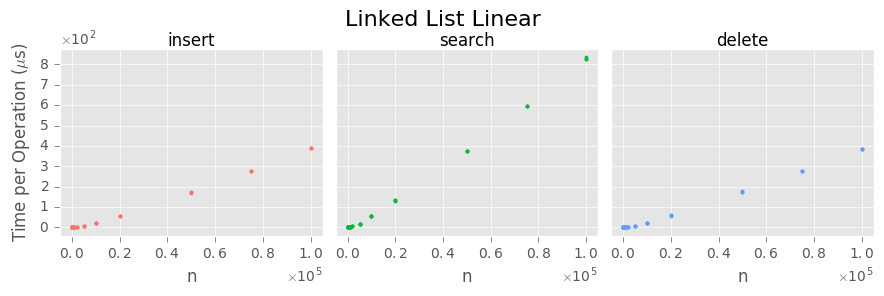

This is a duplicate analysis done in Python.

# Loading libraries, reading data, and setting some options


```python
import numpy as np
import pandas as pd
import matplotlib as mpl
import matplotlib.pyplot as plt

%matplotlib inline
# %matplotlib notebook  # for interativity
```


```python
mpl.style.use('ggplot')

df = pd.read_csv('../data/timing_results.csv')

max_input_size = {"skip list": 10000000,
                  "binary tree": 10000000,
                  "linked list": 100000}

colors = ['#F8766D', '#00BA38', '#619CFF']
```


```python
rows = [struct for struct in df.structure.unique()]
cols = [op for op in df.operation.unique()]
```

# Plot funtions


```python
def plot(struct, type):
    if type == "linear":
        return plot_linear(struct)
    else:
        return plot_log(struct)
```


```python
def plot_linear(struct):
    fig, axes = plt.subplots(1, len(df.operation.unique()), sharex = 'row', sharey = 'row', figsize = (9, 3))
    fig.suptitle(struct.title() + " Linear", size = 16)

    for j, op in enumerate(df.operation.unique()):
        axes[j].scatter(x = 'n', y = 'tpo', data = df[(df.structure == struct) & (df.operation == op)], color = colors[j], s = 5)

        buffer = 0.05

        max_x = df[df.structure == struct]['n'].max()
        max_y = df[df.structure == struct]['tpo'].max()

        lower_x = -buffer * (10 ** np.ceil(np.log10(max_x)))
        upper_x = (1 + buffer) * (10 ** np.ceil(np.log10(max_x)))

        lower_y = -buffer * np.ceil(max_y)
        upper_y = (1 + buffer) * np.ceil(max_y)

        axes[j].set_xlim((lower_x, upper_x))
        axes[j].set_ylim((lower_y, upper_y))

        fig.canvas.draw()
        axes[j].xaxis.major.formatter._useMathText = True
        axes[j].yaxis.major.formatter._useMathText = True

        axes[j].xaxis.get_major_formatter().set_powerlimits((0, 1))
        axes[j].yaxis.get_major_formatter().set_powerlimits((0, 1))

        axes[j].xaxis.set_major_locator(mpl.ticker.MaxNLocator(integer = True))
        axes[j].yaxis.set_major_locator(mpl.ticker.MaxNLocator(integer = True))

        # axes[j].yaxis.set_minor_locator(mpl.ticker.AutoMinorLocator(2))
        # axes[j].xaxis.set_minor_locator(mpl.ticker.AutoMinorLocator(2))
        # axes[j].grid(b = True, which = 'minor', linewidth = 0.5)

        # axes[j].set_axis_bgcolor("silver")

    # set axis labels
    axes[0].set_ylabel(r"Time per Operation ($\mu$s)")
    for i, axis in enumerate(axes):
        axis.set_xlabel("n")
        axis.xaxis.set_ticks_position('bottom')
        if i == 0:
            axis.yaxis.set_ticks_position('left')
        else:
            axis.yaxis.set_ticks_position('none')
    
    # set operation labels
    pad = 2
    for ax, col in zip(axes, cols):
        ax.annotate(col, xy = (0.5, 1), xytext = (0, pad),
                    xycoords = 'axes fraction', textcoords = 'offset points',
                    size = 'large', ha = 'center', va = 'baseline')
    
    plt.tight_layout()
    plt.subplots_adjust(top = 0.85, wspace = 0.05)

    plt.show()
```


```python
def plot_log(struct):
    fig, axes = plt.subplots(1, len(df.operation.unique()), sharex = 'row', sharey = 'row', figsize = (9, 3))
    fig.suptitle(struct.title() + " Logarithmic", size = 16)

    for j, op in enumerate(df.operation.unique()):
        axes[j].scatter(x = 'n', y = 'tpo', data = df[(df.structure == struct) & (df.operation == op)], color = colors[j], s = 5)
        axes[j].set_xscale('log')
        
        # adjust axes
        buffer = 0.05
        max_y = df[df.structure == struct]['tpo'].max()
        
        lower_y = -buffer * np.ceil(max_y)
        upper_y = (1 + buffer) * np.ceil(max_y)

        max_x = df[df.structure == struct]['n'].max()
        lower_x = 10 ** (np.floor(np.log10(df[df.structure == struct]['n'].min()) + 0.5) - 0.99)
        upper_x = 10 ** (np.ceil(np.log10(max_x) + 0.5) - 0.1)
        
        axes[j].set_xlim((10 ** -0.5, upper_x))
        axes[j].set_ylim((lower_y, upper_y))
        
        axes[j].yaxis.major.formatter._useMathText = True
        axes[j].yaxis.get_major_formatter().set_powerlimits((0, 1))
        axes[j].yaxis.set_major_locator(mpl.ticker.MaxNLocator(integer = True))
        
        axes[j].grid(which = 'minor', linewidth = 0.2)
        # axes[j].grid(which = 'major', linewidth = 1)

    # set axis labels and remove ticks on top and right sides of the plot
    axes[0].set_ylabel(r"Time per Operation ($\mu$s)")
    fig.canvas.draw()
    for i, axis in enumerate(axes):
        axis.set_xlabel("n")
        axis.xaxis.set_ticks_position('bottom')
        if i == 0:
            axis.yaxis.set_ticks_position('left')
        else:
            axis.yaxis.set_ticks_position('none')
        
    # set operation labels
    pad = 2
    for ax, col in zip(axes, cols):
        ax.annotate(col, xy = (0.5, 1), xytext = (0, pad),
                    xycoords = 'axes fraction', textcoords = 'offset points',
                    size = 'large', ha = 'center', va = 'baseline')
    
    plt.tight_layout()
    plt.subplots_adjust(top = 0.85, wspace = 0.05)

    plt.show()
```

# Skip List

## Logarithmic


```python
plot("skip list", "log")
```


## Linear


```python
plot("skip list", "linear")
```


# Binary Tree

## Logarithmic


```python
plot("binary tree", "log")
```


## Linear


```python
plot("binary tree", "linear")
```


# Linked List

## Logarithmic


```python
plot("linked list", "log")
```


## Linear


```python
plot("linked list", "linear")
```





```python

```
